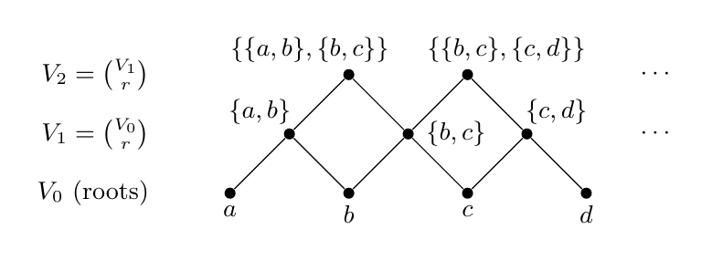
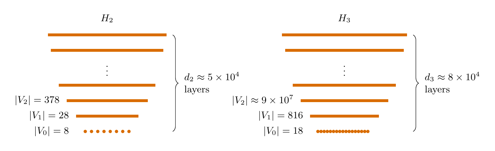
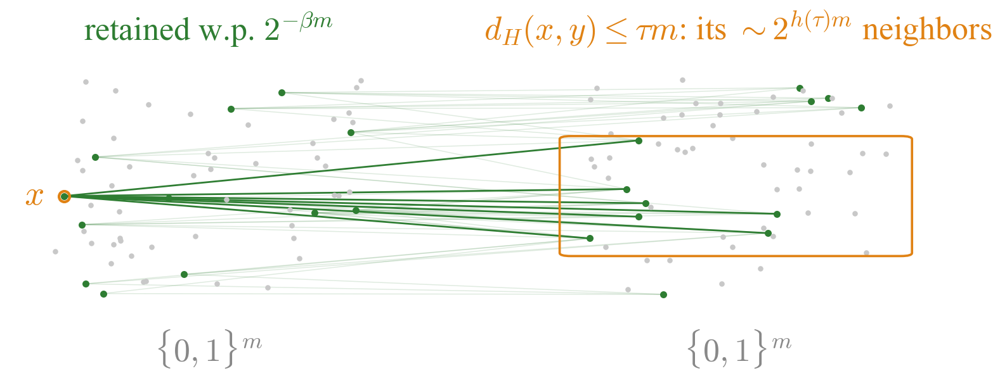
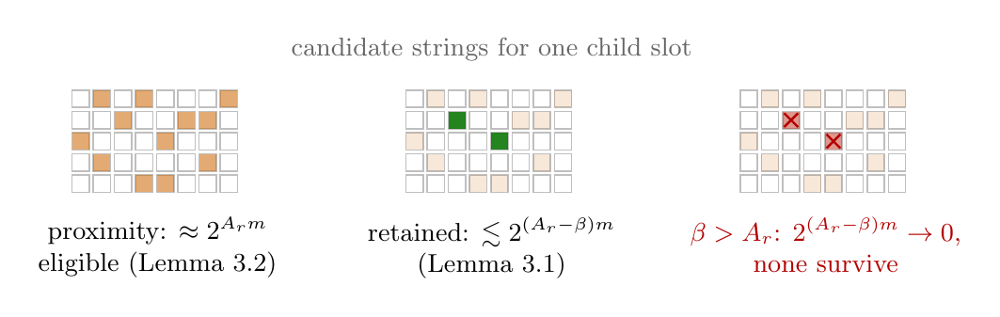
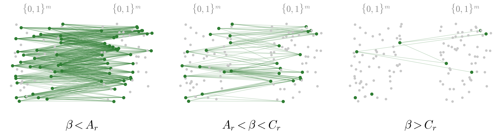
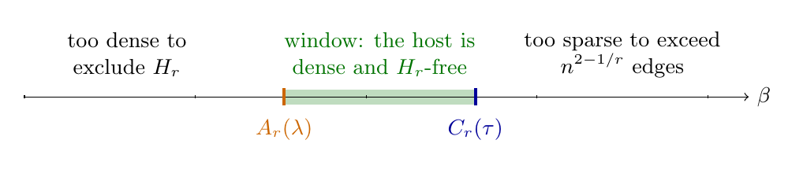
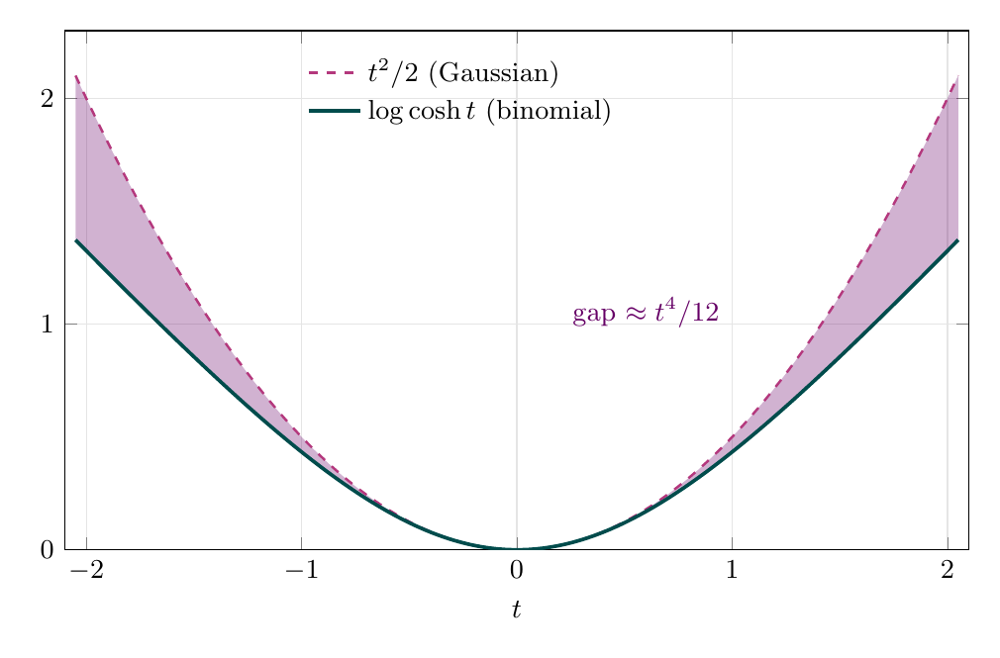
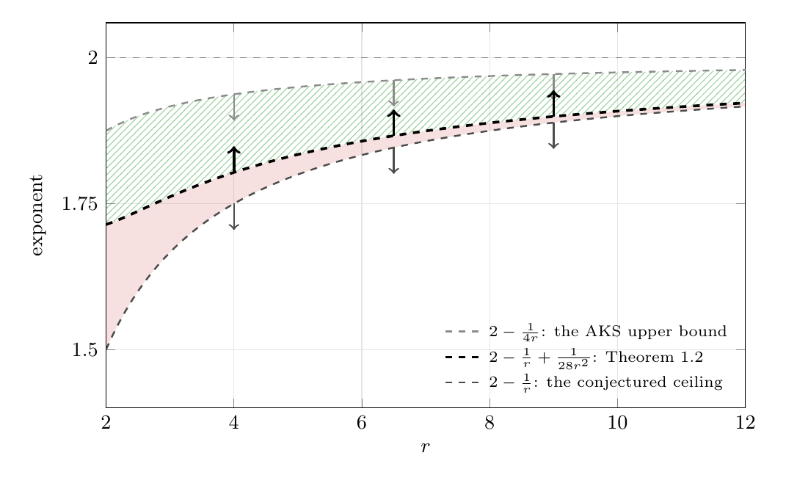

# The Erdős–Simonovits degeneracy conjecture is false for all r ≥ 2

Fable 5, Opus 5 · Christian Lewis<sup>\*</sup> · August 1, 2026

<sub><sup>\*</sup>Evolving Programs, in partnership with High Signal.&nbsp;&nbsp;Last revised August 6, 2026.</sub>

## Abstract

A graph is $r$-degenerate if every induced subgraph of it has minimum degree at
most $r$. Erdős and Simonovits conjectured that every bipartite $r$-degenerate
graph $H$ satisfies $\mathrm{ex}(n,H)=O(n^{2-1/r})$: that $n^{2-\frac1r}$ bounds
the Turán number of $H$ up to a constant factor $C(H)$. The case $r=2$ was refuted by
OpenAI on the morning of August 1, 2026, via a layered Hamming-ball
construction. In this paper, we generalize this construction and prove that the
conjecture fails for every $r\ge2$, and fails by a polynomial margin.

For all $r \ge 2$, there is a connected bipartite graph $H_r$ of degeneracy
exactly $r$ with

$$\mathrm{ex}(n,H_r)\ =\ \Omega\bigl(n^{\,2-\frac1r+\varepsilon_r}\bigr),\qquad\varepsilon_r\ \ge\ \frac1{28r^2}.$$

<p align="center">
<sub>Verification: <a href="proofs/Theorem12.lean"><code>RDegenerateGraphsTarget.rDegenerateExtremalCounterexample_exact</code></a>; at r&nbsp;=&nbsp;3, <a href="proofs/Theorem12r3.lean"><code>ThreeDegenerateGraphsTarget.threeDegenerateExtremalCounterexample_sharp</code></a>.</sub>
</p>

No constant absorbs $n^{\varepsilon_r}$, so the exponent itself exceeds
$2-\frac1r$. At $r=3$ the margin improves to $\varepsilon_3\ge\frac1{160}$. We
also determine the exact reach of the method: its feasible window obeys an
asymptotic law with a sharp phase transition at Gibbs weight $e$, and the
supremal constant of its exponent gain is $1/(8r^2)$, approached at the
exclusion edge but not attained: for every $\delta>0$ and every sufficiently
large $r$ there is a connected bipartite graph $H_{r,\delta}$ of degeneracy
exactly $r$ with

$$\mathrm{ex}(n,H_{r,\delta})\ =\ \Omega\bigl(n^{\,2-\frac1r+\varepsilon_{r,\delta}}\bigr),\qquad\varepsilon_{r,\delta}\ \ge\ \frac{1-\delta}{8r^2}.$$

<p align="center">
<sub>Verification: <a href="proofs/Corollary14.lean"><code>RDegenerateGraphsTarget.twoTierExtremalCounterexample</code></a>.</sub>
</p>

## Outline of the proof

Since $\mathrm{ex}(n,H_r)$ is a maximum over $H_r$-free graphs, a lower bound
must exhibit a single graph with two properties at once: having many edges, and
containing no copy of $H_r$. These two requirements are in tension because
density is exactly what forces copies of a fixed subgraph. 

All three components below originate in OpenAI's result for $r=2$, Chapter 10 of
[*Ten advances in mathematics and theoretical computer
science*](https://github.com/openai/ten-proofs) (2026), cited below as [OAI26].

### The forbidden graph

The degeneracy conjecture is a claim about *every* bipartite $r$-degenerate
graph, so we are free to choose any qualifying $H$. The graph we forbid is the
layered tower $H_r$: above a root layer $V_0$, each layer
$V_{i+1}=\binom{V_i}{r}$ consists of all $r$-element subsets of the previous
one, each subset (a *child*) joined to its $r$ elements (its *parents*). At
$r=2$ this is exactly the layered graph of [OAI26].

<p align="center">

<br>
<sub><em>How H<sub>r</sub> is built, shown at r&nbsp;=&nbsp;2: each child is a 2-subset of the layer below, joined to its two parents.</em></sub>
</p>

<p align="center">

<br>
<sub><em>The counterexamples H<sub>2</sub> and H<sub>3</sub> in true shape, middle levels elided.</em></sub>
</p>

Peeling the layers from the top, each vertex at its removal has no remaining
neighbors other than its $r$ parents, so $H_r$ is $r$-degenerate. The subgraph
induced on the bottom two layers has minimum degree $r$: each child keeps its
$r$ parents, and each root lies in at least $r$ children. Hence $H_r$ is not
$(r-1)$-degenerate.

This places the degeneracy of $H_r$ at exactly $r$. The tower has depth
$\Theta(r^2)$, where [OAI26] needed only a constant: the potential argument
below gains one window width per layer, and the window narrows as $1/r^2$.

### The sparsified Hamming host

Take two copies of the cube $\{0,1\}^m$, join $x$ to $y$ across the copies
whenever their Hamming distance is at most $\tau m$, and retain each vertex
independently with probability $2^{-\beta m}$. This is the host of [OAI26].

Adjacency in this host is proximity in Hamming distance, so an embedded copy of
$H_r$ constrains each child's string to lie near the strings of all $r$ of its
parents; this is the hypothesis on which the entropy argument below rests. The
retention rate contributes the exponent $\beta$, the **sparsity**, which is the
parameter that both thresholds constrain.

A second-moment argument shows that with high probability the retained graph
has $n \approx 2^{(1-\beta)m}$ vertices and $n^\gamma$ edges, where
$\gamma = \frac{1+h(\tau)-2\beta}{1-\beta}$. Because $\beta<1$, the requirement
$\gamma > 2-\frac1r$ can be rearranged as

$$\beta\ <\ C_r(\tau)\ :=\ r\,h(\tau)-(r-1).$$

<p align="center">
<sub>Verification: C<sub>r</sub> is <a href="proofs/lib/LawDefs.lean"><code>DegeneracyLaw.Cside</code></a>; the density claim it thresholds is Lemma 2.2, <a href="proofs/lib/SamplingR.lean"><code>proofs/lib/SamplingR.lean</code></a>.</sub>
</p>

The bound $C_r(\tau)$ is the host's **density threshold** (Lemma 2.2; here $h$
is the binary entropy function); at $r=2$ it is the threshold $2h(\tau)-1$ of
[OAI26].

<p align="center">

<br>
<sub><em>Two copies of {0,1}<sup>m</sup>, joined across Hamming distance at most τm, each vertex retained with probability 2<sup>−βm</sup>.</em></sub>
</p>

### The entropy ceiling

Suppose a copy of $H_r$ survives, and consider the per-bit conditional entropy
of a child's string given the strings of its $r$ parents. Survival bounds it
from *below*: retained strings have density $2^{-\beta m}$, and a first-moment
count rules out every low-entropy embedding, forcing the entropy above $\beta$
(Lemma 3.1). Proximity bounds it from *above*: the child lies within $\tau m$
of each parent, and a Gibbs (soft-max) estimate with weight $2^\lambda$ per
disagreement caps the entropy at an explicit threshold $A_r(\lambda)$, the
entropy ceiling (Lemma 3.2).

For $\beta > A_r$ the two bounds conflict, layer after layer, and a telescoping
potential argument shows that no copy exists (Proposition 3.3). This technique
is that of [OAI26], with two changes: the entropy inequality is generalized
from two parents to $r$, and the Gibbs weight, which [OAI26] fixes at $3$, is
kept as a free parameter $2^\lambda$; this freedom is essential to the window
analysis below.

<p align="center">

<br>
<sub><em>The collision at one child slot: survival forces the conditional entropy above β; proximity caps it at A<sub>r</sub>(λ).</em></sub>
</p>

<p align="center">

<br>
<sub><em>One host at three settings of β (retained vertices green).</em></sub>
</p>

### The feasible window

The two thresholds divide the sparsity axis into three regimes. Below $A_r$ the
entropy argument no longer excludes $H_r$; above $C_r$ the retained host is no
denser than the conjecture permits. Any $\beta$ in between, $A_r(\lambda) <
\beta < C_r(\tau)$, therefore yields a host that is simultaneously dense and
$H_r$-free, refuting the conjecture at level $r$ with exponent gain arbitrarily
close to $\varepsilon_r^{\max}(\beta) = \frac{C_r-\beta}{r(1-\beta)}$.

<p align="center">

<br>
<sub><em>The two thresholds on the sparsity axis; any β between them refutes the conjecture at level r. Not drawn to scale.</em></sub>
</p>

Whether the window is nonempty is the point at which this work departs from
[OAI26]. At $r=2$, [OAI26] evaluates both thresholds at the single radius
$\tau=1/(1+\sqrt3)$ and exhibits a window of positive constant width in closed
form. At general $r$ no fixed radius succeeds: both thresholds lie at
$1-\Theta(1/r)$, so the radius must approach $\tau=\frac12$. The comparison
therefore moves to the lower-order terms, where each threshold has an explicit
expansion.

The density threshold inherits its expansion from the binary entropy: at
$\tau=\frac12-\frac{c}{r}$, it falls below $1$ by a Gaussian (quadratic) cost
in the radius offset $c$:

$$C_r(\tau)\ =\ r\,h(\tau)-(r-1)\ =\ 1-\frac{2c^2}{\ln2}\cdot\frac1r-O\Bigl(\frac1{r^3}\Bigr).$$

<p align="center">
<sub>Verification: <a href="proofs/lib/WindowLowerBound.lean"><code>TwoDegenerateGraphs.binaryEntropy_gap_bounds</code></a>, bracketing 1&nbsp;&minus;&nbsp;h(&frac12;&nbsp;&minus;&nbsp;x) between 2x²/ln2 and 2x²/ln2&nbsp;+&nbsp;3x⁴/ln2 for |x|&nbsp;&le;&nbsp;&frac14;.</sub>
</p>

For the entropy ceiling, a concavity argument (Lemmas 4.1 and 4.2)
places the maximizer of the optimization defining $A_r$ at the center, where
the Gibbs soft-max over the $r$ parent bits collapses to a binomial
$\log\cosh$ average over $S_r = 2\,\mathrm{Bin}\bigl(r,\tfrac12\bigr)-r$, the
popcount fluctuation of $r$ fair parent bits:

$$A_r\ =\ \lambda\tau+1-\frac{\lambda}{2}+\mathbb{E}\,\log\cosh\Bigl(\frac{\lambda\ln2}{2r}\,S_r\Bigr).$$

<p align="center">
<sub>Verification: the center value is <a href="proofs/lib/WindowUpperBound.lean"><code>DegeneracyLaw.Gfun_center_eq</code></a>; that the supremum is attained there is <a href="proofs/Lemma42.lean"><code>DegeneracyLaw.LemmaB.supG_eq_center</code></a>. A<sub>r</sub> itself is <a href="proofs/lib/LawDefs.lean"><code>DegeneracyLaw.Aside</code></a>.</sub>
</p>

Since $\mathbb{E}S_r^2=r$, the $\log\cosh$ term is Gaussian at leading order
as well, and the $1/r$ coefficient of $C_r-A_r$ collects to the nonpositive
square $-(4c-\lambda\ln2)^2/(8\ln2)$: the choice $c=\frac{\lambda\ln2}{4}$ is
forced, and at the tuned radius $\tau_r=\frac12-\frac{\lambda\ln2}{4r}$ the
quadratic parts of the two thresholds cancel exactly. The width is decided one
order lower, where the two sides differ: $\log\cosh t$ lies below its parabola
$t^2/2$ by the quartic defect $t^4/12$, so through $\mathbb{E}S_r^4=3r^2-2r$
the ceiling $A_r$ sits below its Gaussian surrogate, and

$$w_r\ :=\ C_r-A_r\ =\ \frac{\lambda^4\ln^32}{64\,r^2}\Bigl(1+O(\tfrac1r)\Bigr)\ >\ 0.$$

<p align="center">
<sub>Verification: positivity for every r&nbsp;&ge;&nbsp;2 at &lambda;&nbsp;=&nbsp;27/20 is <a href="proofs/lib/AssemblyR.lean"><code>DegeneracyLaw.width_pos_all</code></a>, on <a href="proofs/Lemma44.lean"><code>DegeneracyLaw.LemmaC.width_ge</code></a>; the asymptotic form is Theorem 1.3(a), <a href="proofs/Theorem13a.lean"><code>DegeneracyLaw.width_tendsto_unconditional_full</code></a>.</sub>
</p>

Binomial fluctuations are entropically cheaper than their Gaussian surrogate,
and this discrepancy alone is the source of the counterexample.

<p align="center">
&nbsp;&nbsp;

<br>
<sub><em>Left: log cosh t lies below its parabola t<sup>2</sup>/2. Right: the exponent of ex(n, H<sub>r</sub>) against r (gap exaggerated).</em></sub>
</p>

Take $\beta$ just inside the exclusion edge $A_r$, which is the optimal end of
the window by Theorem 1.3(b). Together with the bound $w_r \ge 0.00603/r^2$ of
Lemma 4.4, certified in exact rational arithmetic at $\lambda=\frac{27}{20}$
for every $r\ge2$, this yields the $1/(28r^2)$ of Theorem 1.2; the
specialization $w_3 \ge 0.0098/9$ gives the gain $1/160$ at $r=3$.

Letting $\lambda$ vary instead determines the limits of the method. Below the
critical weight $2^\lambda=e$ the rescaled width converges,
$r^2 w_r \to \lambda^4\ln^32/64$, while above it $r^2 w_r \to -\infty$
(Theorem 1.3(a)); across the window the certified gain obeys the family law of
Theorem 1.3(b), whose supremum $1/(8r^2)$ is approached at the exclusion edge
and not attained; and the schedule $\lambda_r = \frac{1-(\ln r)/r}{\ln 2}$,
subcritical for every $r$ and critical in the limit, recovers the ceiling up
to any prescribed loss $\delta$ (Corollary 1.4).

## Verification

Every theorem in the paper is machine-checked in Lean 4 over mathlib
(`v4.32.0`), sorry-free, with axioms `propext`, `Classical.choice`,
`Quot.sound`.

| Paper statement           | Lean declaration                                                          | File                                     |
|---------------------------|---------------------------------------------------------------------------|------------------------------------------|
| Theorem 1.2, general $r$  | `RDegenerateGraphsTarget.rDegenerateExtremalCounterexample_exact`          | [`proofs/Theorem12.lean`](proofs/Theorem12.lean)       |
| Theorem 1.2, $r=3$        | `ThreeDegenerateGraphsTarget.threeDegenerateExtremalCounterexample_sharp`  | [`proofs/Theorem12r3.lean`](proofs/Theorem12r3.lean)   |
| Theorem 1.3(a)            | `DegeneracyLaw.width_tendsto_unconditional_full`                           | [`proofs/Theorem13a.lean`](proofs/Theorem13a.lean)     |
| Theorem 1.3(a), sharpness | `DegeneracyLawSuper.threshold_sharp`                                       | [`proofs/lib/WindowSharp.lean`](proofs/lib/WindowSharp.lean)   |
| Theorem 1.3(b)            | `DegeneracyLawB.eight_rsq_epsMax_theta_tendsto`                            | [`proofs/Theorem13b.lean`](proofs/Theorem13b.lean)     |
| Corollary 1.4             | `RDegenerateGraphsTarget.twoTierExtremalCounterexample`                    | [`proofs/Corollary14.lean`](proofs/Corollary14.lean)   |

"Degeneracy exactly $r$" is carried literally as
`IsDegenerate r H ∧ ¬ IsDegenerate (r-1) H`, and the exponents appear as
written.

- Build: `lake exe cache get && lake build` (toolchain pinned by
  `lean-toolchain`). The default targets are sorry-free; the declaration
  inventory is [`formalization.yaml`](formalization.yaml). CI runs the build
  on every push.
- Challenges: each theorem is frozen as a standalone
  [Comparator](https://github.com/leanprover/comparator) statement in
  [`challenges/`](challenges/) (each ends in an intentional `sorry`) and
  discharged verbatim by the corresponding `Solution*.lean`:
  `for c in challenges/challenge*.json; do lake env comparator $c; done`.
- Independent numerics: `python3 tests/numerics_check.py` re-computes the
  window, ledger, and degeneracy claims outside Lean.

## Layout

All Lean sources live under [`proofs/`](proofs/):

- `proofs/` itself holds the named results, each in the file named after it.
- [`proofs/lib/`](proofs/lib/) holds the machinery: host and sampling, the
  entropy kernel and the exclusion argument, the analytic lemmas of Section 4
  behind the window, the ledger and its asymptotics, and the two-tier
  schedule. `proofs/lib/CompactnessAndDegeneracy.lean` is OpenAI's published
  $r=2$ file, vendored verbatim (Apache-2.0; see [`NOTICE`](NOTICE)).
- [`proofs/scratch/`](proofs/scratch/) holds a second, independent route to
  the $r=3$ case, built from hand-certified numerics and importing none of the
  general-$r$ analytic machinery. It reaches the weaker gain $1/4000$; the
  headline $1/160$ comes from the general pipeline. It is kept precisely
  because it is independent, so the $r=3$ result does not rest on a single
  chain.

Tests are in `tests/` and the frozen Comparator statements in `challenges/`.

## Acknowledgments

We thank Sai Gajjala of New York University for contributing to the Lean
formalization, and Elliot Glazer of Principia Labs for notes on the Lean
development and Comparator setup.

## Citation

Cite as: Fable et al., *A new lower bound for the degenerate Turán problem*, 2026.

```bibtex
@misc{fable2026degenerate,
  author = {{Fable 5} and {Opus 5} and Lewis, Christian},
  title  = {A new lower bound for the degenerate {T}ur\'an problem},
  year   = {2026},
  url    = {https://github.com/EvolvingPrograms/erdos-simonovits-degeneracy}
}
```

## Remarks

- The constants are not optimal: interval evaluation of the window at each
  fixed small $r$ would push $1/(28r^2)$ toward $1/(21r^2)$ and
  $\varepsilon_3$ toward $1/138$.
- The towers $H_r$ are enormous; the smallest bipartite $r$-degenerate graph
  violating the conjectured exponent is an open problem, already at $r=2$.
- The gap to the $O(n^{2-1/(4r)})$ upper bound of Alon–Krivelevich–Sudakov is
  of order $1/r$; closing it requires a construction outside this method's
  $1/(8r^2)$ ceiling.
